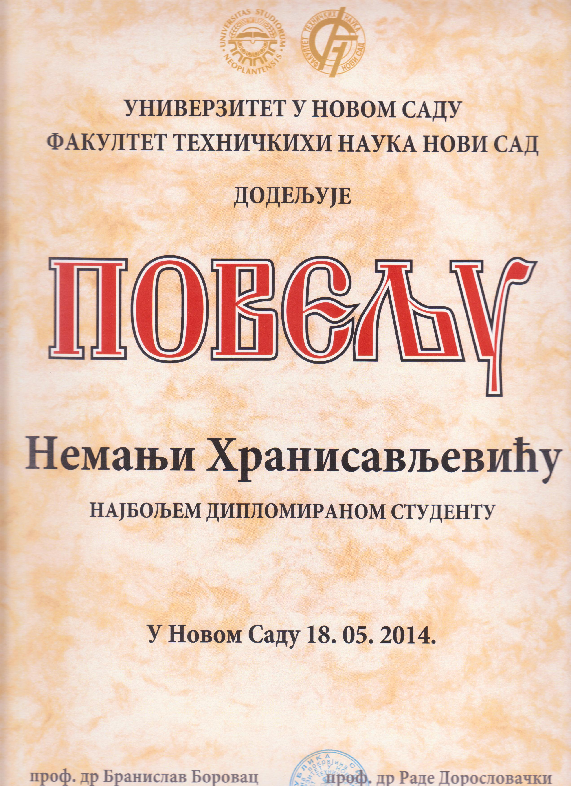

## Welcome to Nemanja's GitHub Page
Hello, my name is Nemanja Hranisavljevic and I am a research associate at [Fraunhofer IOSB-INA](https://www.iosb-ina.fraunhofer.de/). 
You can reach me on [nemanja.hranisavljevic@iosb-ina.fraunhofer.de](mailto:nemanja.hranisavljevic@iosb-ina.fraunhofer.de).

My research is focused on learning hybrid behavioral models from historical data in the domain of cyber-physical production systems. The main studied idea is discretization of continuous behavior using deep neural networks as proposed in DENTA algorithm: 
[Discretization of hybrid CPPS data into timed automaton using restricted Boltzmann machines (2020)](http://www.sciencedirect.com/science/article/pii/S0952197620301986)

Currently I am working on a framework for simulation/data generation and model learning of cyber-physical systems [time4cps](). It will be published in the next months.

### My portfolio:

- Studied Computer Sciences and Automation at [Faculty of Technical Sciences](http://www.ftn.uns.ac.rs/), University of Novi Sad, Serbia.
    Finished with the student award 

