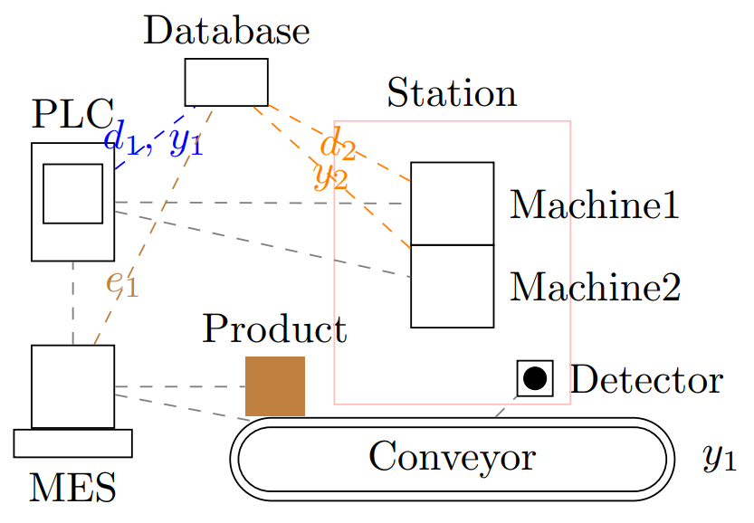

### Artificial Intelligence for Cyber-Physical Systems

### Coming soon...

#### Production systems
The term cyber-physical production system (CPPS) refers to a network of actuators, sensors, controllers and other devices which intensively communicate in order to achieve physical production of goods.
The key enablers for the fast and wide spreading of this distributed design are advances in information technology, big data and communication technologies.
The doors got opened for the newest models and algorithms from the field of artificial intelligence (AI) and machine learning (ML) to be developed and applied, in order to achieve safer, more reliable and, in various ways, more efficient production.
The large potential and significance of this development can be seen in the political and economical decisions around the world, supposed to stimulate the ongoing 'fourth industrial revolution' (Industry 4.0).

*Example toy CPPS*
